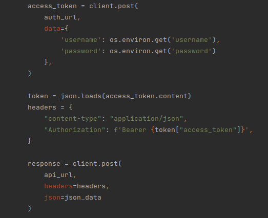

# FastAPI-google-geolocation
Developed this app to process AP scan bssid's into location, latitude and longitude

### Features

1. slowapi - limited to 45 requests a second
2. expiring-dict - Cache items expire, not the whole cache
3. python-dotenv - store sensitive information
4. pytest - api tested


## .env File

The .env file is used to inject the system variables for the application

In order for the app to work and to get login details create .env file in the root
And update it with these records

### N.B. You beed a valid google api key

    google-maps-url-json=https://www.googleapis.com/geolocation/v1/geolocate?key=test
    SECRET=aruba-ap-geolocation-app
    username=admin@aruba.com
    password=password_strong


## Endpoints

    http://0.0.0.0:8000/docs/

Get on root, accepts json, no authentication, used to monitor uptime 

    http://0.0.0.0:8000/
    
Use username and password to get bearer token

    http://0.0.0.0:8000/api/v1/auth/token

Use token to hit main request

    http://0.0.0.0:8000/api/v1/

### Pytest



## Insomnia root status


## Insomia Authentication

To get the token


To use the token


### Data structure needed

```
{
    "apscan_data": [
      {
        "band": "5.0",
        "bssid": "e8:1d:a8:68:a6:6c",
        "channel": "44",
        "frequency": 5220,
        "rates": "6.0 - 866.7 Mbps",
        "rssi": -67,
        "security": "open",
        "ssid": "McDonalds@VAST",
        "timestamp": 1523180151.0,
        "vendor": "Ruckus Wireless",
        "width": "80"
      },
      {
        "band": "2.4",
        "bssid": "c0:a0:bb:c4:10:d6",
        "channel": "1",
        "frequency": 2412,
        "rates": "1.0 - 54.0 Mbps",
        "rssi": -64,
        "security": "wpa-psk",
        "ssid": "default",
        "timestamp": 1523180151.0,
        "vendor": "D-Link International",
        "width": "40"
      }
    ]
  }
```

## Virtual Env

In the root of the directory

    sudo apt install python3.9-venv

    python3.9 -m venv FastAPI_env

    source FastAPI_env/bin/activate

    pip install -r requirements.txt
    pip install --upgrade pip

### Run tests

In the root directory

    cd app
    pytest
    python3.9 main.py

Or in root of directory 

    python3.9 app/main.py

## Docker

To get docker up we build it first

    docker build -t aruba-geolocation-api .

Then run it with .env file

    docker run --env-file .env -it --rm -p 80:80 aruba-geolocation-api

## Pytest

Bash into Docker image

    docker run --env-file .env -it --rm -p 80:80 aruba-geolocation-api bash

Then run

    cd app
    pytest


# Pytest code for test_api_no_cache()

Each test has to be setup and monitored

For the tests I use the scan.json file
```

    api_url  = "/api/v1"
    auth_url = "/api/v1/auth/token"
    client   = TestClient(app)

    with open('scan.json') as json_file:
        test_json = json.loads(json_file.read())

    stats = {
        'cached'   : 0,
        'uncached' : 0,
    }

```

## Set TTL

    test_data['ttl'] = 0

For the second test this step isn't taken.

Cache expires immediately leading to the cache not being used

```

    for test_data in test_json:

        # NB enable instant expire on cache with this key
        test_data['ttl'] = 0
        request_response = process_request(client, auth_url, api_url, test_data)
        json_content     = json.loads(request_response.content)
        if json_content['cached']:
            stats['cached'] += 1
        else:
            stats['uncached'] += 1
        assert request_response.status_code == 200
    assert stats['cached'] == 0
    assert stats['uncached'] == 1604

```
Then we assert the request_response.status_code to be 200
And assert all items are uncached


## Meat and bones

First we need to get the access token, so we POST the auth_url with data : username and password

```

# Meat and bones of the two tests
def process_request(client, auth_url, api_url, json_data):
    access_token = client.post(
        auth_url,
        data={
            'username': os.environ.get('username'),
            'password': os.environ.get('password')
        },
    )

```

Then we use the token bearer in the headers to send the apscan_data

```

    token = json.loads(access_token.content)
    headers = {
        "content-type": "application/json",
        "Authorization": f'Bearer {token["access_token"]}',
    }

    response = client.post(
        api_url,
        headers=headers,
        json=json_data
    )

    return response

```

## Calling google API

Setting the tests variable is done by checking the url Pytest assigns

```
    global test
    global cache_expire

    #  When we test, we can't hit google api
    if 'http://testserver/' in request.base_url.__str__():
        test = True
```

I needed to return data for the tests without hitting the google endpoints

```
    # Testing skips unwanted calls
    if not test:
        request = requests.post(
            os.environ.get('google-maps-url-json'),
            json=json
        )
        response = request.json()
    else:
        # return same data for testing
        response = {
            "location": {
                "lat": -26.2707593,
                "lng": 28.1122679
            },
            "accuracy": 1
        }
```


### Helpful Commands

List images

    docker images

Remove Images

    docker rmi -f Image_id

List containers

    docker container ls --all

Remove Container

    docker container rm container_id

